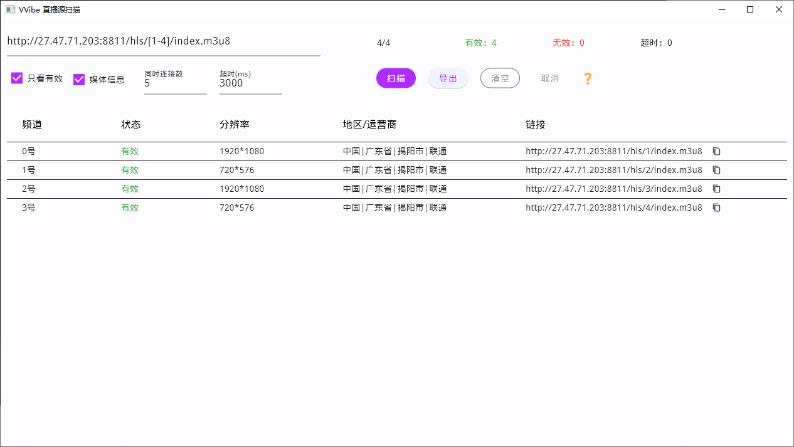

# vvibe

> 自用的视频直播观看软件

## 功能

- 播放本地文件``m3u``或``txt``播放列表
- 订阅远程``m3u``或``txt``播放列表
- 支持``虎牙``，``斗鱼``和``哔哩哔哩``的实时弹幕 （请确保m3u文件的group-title分别为斗鱼或douyu、虎牙或huya、 B站或bilibili, tvg-id为真实房间id）
- 播放列表管理，分组、搜索和实时检测
- 打开单个网络链接
- 播放器基本设置
- 直播源扫描和导出
- 扫源时获取IPV4地址信息和媒体信息
  
## 多平台

    目前仅支持windows，暂无其他平台支持计划

## 开发

- 拉取项目，安装依赖
- 安装配置``ffmpeg``(已测试版本为``4.4.1``,其他版本未测试_和``LLVM``。[下载ffmpeg](https://github.com/GyanD/codexffmpeg/releases/download/4.4.1/ffmpeg-4.4.1-full_build-shared.zip),解压后，设置环境变量``FFMPEG_DIR``为ffmpeg解压目录。更多信息，请参考[这里](https://github.com/zmwangx/rust-ffmpeg/wiki/Notes-on-building))
- 搭建``rust``环境(``rust ``版本大于1.66)，参考[rustup](https://www.rust-lang.org/zh-CN/tools/install)。 Window平台中复制``ffmpeg/bin``目录下的所有``dll``到``cargo/bin``目录, 否则``rust-ffmpeg``可能出错。
- 首次运行 ``flutter_rust_bridge_codegen  --rust-input rust/src/api.rs  --dart-output lib/bridge_generated.dart ``

- 启动项目

## 截图

## 注意事项

1、有些包不支持 safety模式。解决方案：``--no-sound-null-safety``

- run
``flutter run --no-sound-null-safety``
- build
``flutter build apk --no-sound-null-safety``

2、项目使用了[rust-ffmpeg](https://github.com/meh/rust-ffmpeg)，需要提前配置编译环境 

3、关于``flutter_rust_bridge``，具体参考 [flutter-rust-bridge](http://cjycode.com/flutter_rust_bridge/) 

4、若编译``rust-ffmpeg``出现``exit code: 0xc0000135, STATUS_DLL_NOT_FOUND``错误或扫源时无法获取媒体信息(Windows平台中显示无法加载``native.dll``)，Window平台中复制``ffmpeg/bin``目录下的所有``dll``到``cargo/bin``目录。具体参考 https://github.com/zmwangx/rust-ffmpeg/issues/119 进行设置。 。

## 声明

- 本项目仅作为个人兴趣项目，不得用于商业用途或其他任何违法行为；使用者使用本项目时，自行承担风险，由使用该项目引发的任何法律纠纷与本人无关。
- 相关资源的版权归原公司所有。
- 测试数据来源于互联网公开内容，没有收集任何私有和有权限的信息（个人信息等），由此引发的任何法律纠纷与本人无关。

## 致谢

- [mdk-sdk](https://github.com/wang-bin/mdk-sdk)
- [fvp](https://github.com/wang-bin/fvp)
- [ice_live_viewer](https://github.com/iiijam/ice_live_viewer)

## 备注

-本应用不内置播放源，请自行准备直播源(源代码playlist目录中播放源仅供开发测试，请勿用于其他途径)

-直播平台播放源的解析可参考 [real-url](https://github.com/moxun33/real-url)  , 可自行搭建服务器定时解析，推荐使用[青龙](https://github.com/whyour/qinglong)，``虎牙``，``斗鱼``和``哔哩哔哩``的直播源解析的青龙脚本 [ql-scripts](https://github.com/moxun33/ql-scripts)
- 使用[mdk-sdk](https://github.com/wang-bin/mdk-sdk)开发flutter插件进行视频播放，相对于``dart-vlc``性能大幅提升，产物大小大幅降低
- 若无法自动下`mdk-sdk`, 手动[下载mdk-sdk](https://sourceforge.net/projects/mdk-sdk/files/nightly/mdk-sdk-windows-desktop-vs2022.7z)后解压到 `windows/flutter/ephemeral/.plugin_symlinks/fvp/windows/`目录下
- 视频播放器`fvp`插件的`API`持续开发中
- ffmpeg下载地址 https://github.com/GyanD/codexffmpeg/releases 本项目的ffmpeg版本为4.4.1
