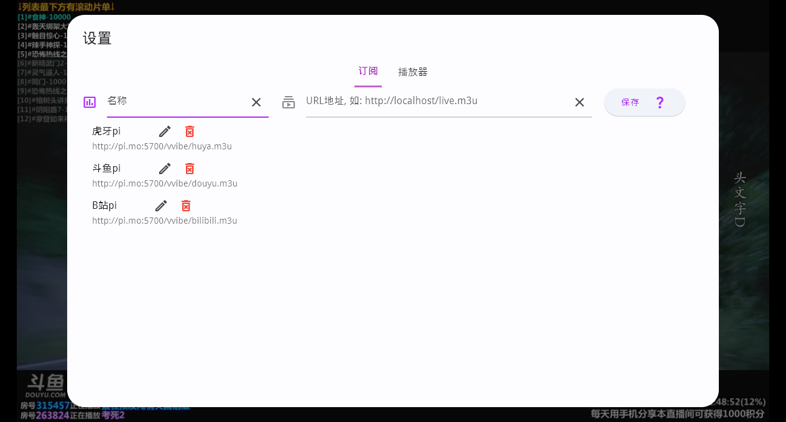

# vvibe


[](https://github.com/moxun33/vvibe/releases)
[](https://github.com/moxun33/vvibe/releases)


[](https://github.com/moxun33/vvibe/actions)

> 视频直播观看软件

## 功能

- 播放本地文件``m3u``或``txt``播放列表
- 订阅远程``m3u``或``txt``播放列表
- 支持三大平台的实时弹幕 （条件：1、m3u文件的``group-title``分别为（或包含）平台中文名或拼音, ``tvg-id``为真实房间id；2、代理地址，格式为``/douyu.php?id={roomid}``或pathname以``/douyu/{roomid}``结尾）
- ~~发送匿名弹幕 [hack.chat](https://hack.chat)🤩🤩🤩 (科学上网)~~
- 播放列表管理，分组、搜索和实时检测
- 打开单个网络链接
- 单个网络链接也支持弹幕(条件同播放列表)。
- 播放器基本设置
- 单个网络订阅/本地文件的播放设置：UA、EPG等
- 支持快捷键
- ~~直播源扫描和导出~~
- ~~扫源时获取IPV4地址信息和媒体信息~~

## 多平台

    目前仅支持windows、linux，暂无其他平台支持计划

## 开发

- 拉取项目代码，运行``flutter pub get``安装依赖

- 启动项目

## 截图




## 注意事项

## 声明

- 本项目仅作为个人兴趣项目，仅用于测试与学习交流，不得用于商业用途或其他任何违法行为；使用者使用本项目时，自行承担风险，由使用该项目引发的任何法律纠纷与本人无关。
- 相关资源的版权归原公司所有。
- 测试数据来源于互联网公开内容，没有收集任何私有和有权限的信息（个人信息等），由此引发的任何法律纠纷与本人无关。
- 弹幕接口仅用作测试，请勿用于其他非法途径。若侵权，请联系本人删除。

## 致谢

- [fvp](https://github.com/wang-bin/fvp)([mdk-sdk](https://github.com/wang-bin/mdk-sdk))

## 备注

- 本应用不内置播放源，请自行准备直播源(源代码playlist目录中播放源仅供开发测试，请勿用于其他途径)

- 直播平台播放源的解析可参考 [real-url](https://github.com/moxun33/real-url)  , 可自行搭建服务器定时解析，推荐使用[青龙](https://github.com/whyour/qinglong)，``虎牙``，``斗鱼``和``哔哩哔哩``的直播源解析的青龙脚本 [ql-scripts](https://github.com/moxun33/ql-scripts)

- 若无法自动下`mdk-sdk`, 手动[下载mdk-sdk](https://sourceforge.net/projects/mdk-sdk/files/mdk-sdk-windows-desktop-vs2022.7z)后解压到 `windows/flutter/ephemeral/.plugin_symlinks/fvp/windows/`目录下; 其他平台操作类似
- 视频播放器`fvp`插件的`API`持续开发中
- ~~ffmpeg下载地址 https://github.com/GyanD/codexffmpeg/releases 本项目的ffmpeg版本为4.4.1~~

- 项目还使用或借鉴了未列出的其他项目，同样在此感谢。

- epg

```bash

http://epg.aptvapp.com/xml
http://epg.51zmt.top:8000/e.xml.gz
https://assets.livednow.com/e.xml.gz
https://live.fanmingming.com/e.xml.gz
https://epg.v1.mk/fy.xml.gz

```
